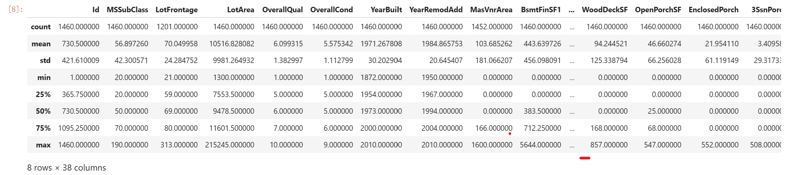

# 1.什么是机械学习

1. 在没有明确设置的情况下，使计算机具有学习能力的研究领域
2. 计算机程序从经验E中学习，解决某一任务T，进行某一性能度量P，通过P测定在T上的表现因经验E而提高。
3. 能够让系统从数据中学习的计算机科学

## 监督学习与非监督学习

监督学习：人让计算机学习
无监督学习：计算机自动学习

### 监督学习

给予计算机一个正确的数据集，让它通过已知的数据去推算未出现在数据集的数据的值（拟合出函数）

常见的监督学习：回归和分类

### 无监督学习

聚类算法：输入一个无序数据集，让程序自动将其分类
鸡尾酒会算法：输入一段复合多个音频的音频，让程序将不同音频分离出来

可视化：

降维：

关联规则学习：

## 学习方向

应用机器学习

梯度提升机(XGBoost库)和深度学习(Keras库)

## 测试与验证

方式：将样本分为训练集，测试集和验证集三部分

泛化误差：应对新场景的误差率。通过测试集得到对这个误差的估值以反映模型的优劣

训练误差：模型在训练集中的出错率

### 场景模拟

如果训练误差很低，泛化误差很高，证明模型对于训练数据存在过度拟合

假设有一个线性模型和一个正则模型，如何判断这两个模型的优劣：

训练两个模型，对比他们对测试数据的泛化能力

假设线性模型泛化能力更强，但你想要应用一些正则化来避免过度拟合，怎么做？

<details>
做法之一是使用100个不同的超参数值来训练100个不同的模型。然后假设你由此找到了最佳的超参数值，它生成的模型泛化误差最小，比如仅仅5%。然后你将这个模型运行在生产环境，可是很不幸，它并没有如预期那样工作，反而产生了15%的误差。这到底发生了什么？问题出在你对测试集的泛化误差进行了多次度量，并且调整模型和超参数来得到拟合那个测试集的最佳模型。这意味着该模型对于新的数据不太可能有良好的表现。
常见的解决方案是再单独分出一个保留集合，称为验证集。在训练集上，使用不同的超参数训练多个模型，然后通过验证集，选择最好的那个模型和对应的超参数，当你对模型基本满意之后，再用测试集运行最后一轮测试，并得到泛化误差的估值。
为了避免验证集“浪费”太多的训练数据，常见的技术是使用交叉验证：将训练集分成若干个互补子集，然后每个模型都通过这些子集的不同组合来进行训练，之后用剩余的子集进行验证。一旦模型和超参数都被选定，最终的模型会带着这些超参数对整个训练集进行一次训练，最后再用测试集测量泛化误差。
<summary><mark><font color=darkred>点击查看详细内容</font></mark></summary>
<details>
## 没有免费午餐定理

模型是观察的简化。这个简化是丢弃了那些不大可能泛化至新实例上的多余细节。但是，要决定丢弃哪些数据以及保留哪些数据，你必须要做出假设。

内容：如果你数据绝对没有任何假设，那你没有理由会偏向某个模型。

## 问答

什么是被标记的训练集？

包含每个实例所期望的解决方案的训练集

什么是在线学习系统？

在线学习系统是一种可以进行增量学习，可以快速适应不断变化的数据和自动化系统，并且能够在大量数据上进行训练。其与批量学习系统正好相反。

什么是核外学习？

核外算法可以处理计算机主内存无法应对的大量数据。它将数据分割成小批量，然后使用在线学习技术从这些小批量中学习。

# 2.端到端的机器学习项目

## 情景引入

完成一个房地产项目：

1. 观察大局
2. 获得数据
3. 从数据探索和可视化中获得洞见
4. 机器学习算法的准备
5. 选择和训练模型
6. 微调模型
7. 展示方案
8. 启动，监控和维护系统

## 真实数据来源

流行的开放数据存储库：
·[UC Irvine Machine Learning Repositor](http://archive.ics.uci.edu/ml/)
·[Kaggle dataset](https://www.kaggle.com/datasets)
·[Amazon’s AWS dataset](http://aws.amazon.com/fr/datasets/)
·元门户站点（它们会列出开放的数据存储库）：
· [http://dataportals.org/](http://dataportals.org/)
· [http://opendatamonitor.eu/](http://opendatamonitor.eu/)

· [http://quandl.com/](http://quandl.com/)
·其他一些列出许多流行的开放数据存储库的页面：
·[Wikipedia’s list of Machine Learning dataset](https://goo.gl/SJHN2k)
·[Quora.com question](http://goo.gl/zDR78y)
·[Datasets subreddit](https://www.reddit.com/r/datasets)

## 观察大局

1. 根据加州人口普查数据建立加州的房价模型
2. 询问业务目标
3. 询问解决方案
4. 设计系统
5. 选择性能指标
6. 检查假设

### 流水线

一个序列的数据处理组件称为一个数据流水线（Pipeline）。流水线在机器学习系统中非常普遍，因为需要大量的数据操作和数据转化才能应用。组件通常是异步运行。每个组件拉取大量的数据，然后进行处理，再将结果传输给另一个数据仓库；一段时间之后，流水线中的下一个组件会拉取前面的数据，并给出自己的输出，以此类推。每个组件都很独立：组件和组件之间的连接只有数据仓库。这使得整个系统非常简单易懂（在数据流图表的帮助下），不同团队可以专注于不同的组件上。如果某个组件发生故障，它的下游组件还能使用前面的最后一个输出继续正常运行（至少一段时间），所以使得整体架构鲁棒性较强。

### 问答

首先，你需要回答框架问题：是监督式？还是无监督式？又或者是强化学习？是分类任务、回归任务还是其他任务？应该使用批量学习还是在线学习技术？在继续阅读之前，请先暂停一会儿，尝试回答一下这些问题。

找到答案了吗？我们来看看：显然，这是一个典型的监督式学习任务，因为已经给出了标记的训练示例（每个实例都有预期的产出，也就是该地区的房价中位数）。并且这也是一个典型的回归任务，因为你要对某个值进行预测。更具体地说，这是一个多变量回归问题，因为系统要使用多个特征进行预测（使用到区域的人口、收入中位数等）。

## 获取数据（模型构建与检测）

```pyhton
import pandas as pd

# 假设数据集文件(csv文件)路径为C:\library\melb_data.csv

# 读取数据集
a='C:\library\melb_data.csv'
home_data=pd.read_csv(a)

# 打印数据集的汇总统计信息
print(home_data.describe())

# 打印数据集的部分数据信息
print(home_data.head())

#打印lotarea的平均数
print(home_data['LotArea'].main())

```

### 汇总信息图



*每一列表示数据集的一个属性*，*每一行表示这些属性的信息*

### 部分信息图

|   | Rooms | Bathroom | Landsize | Lattitude | Longtitude |
| - | ----- | -------- | -------- | --------- | ---------- |
| 1 | 2     | 1.0      | 156.0    | -37.8079  | 144.9934   |
| 2 | 3     | 2.0      | 134.0    | -37.8093  | 144.9944   |
| 4 | 4     | 1.0      | 120.0    | -37.8072  | 144.9941   |
| 6 | 3     | 2.0      | 245.0    | -37.8024  | 144.9993   |
| 7 | 2     | 1.0      | 256.0    | -37.8060  | 144.9954   |

解析：
count：每个属性的样本总数

mean：平均数

std：标准差

min：最小值；max：最大值

以lotfrontage为例

25%：样本25%的区域低于59

50%：样本50%的区域低于69

75%：样本75%的区域低于80

### 对数据集的筛选

我们输入的数据集有时会出现缺失值（不一定在每一列均有取值的数据），这些数据会引发误差，我们通过以下两种方法来减少误差：

1. 点表示法（用来选取预测目标）
2. 根据列的列表来选择属性

```
# The Melbourne data has some missing values (some houses for which some variables weren't recorded.)
# We'll learn to handle missing values in a later tutorial.  
# Your Iowa data doesn't have missing values in the columns you use. 
# So we will take the simplest option for now, and drop houses from our data. 
# Don't worry about this much for now, though the code is:

# dropna drops missing values (think of na as "not available")
melbourne_data = melbourne_data.dropna(axis=0)
```

#### 选取预测目标

我们使用点表示法来选取预测目标. 为了方便我们称其为 y. So the code we need to save the house prices in the Melbourne data is

In [3]:

```
y = melbourne_data.Price
```

#### 选取特征

输入到模型中(后来用于预测的列)称为“特征”，在这个项目中，“特征”将被用于预测房价

Here is an example:

In [4]:

```
melbourne_features = ['Rooms', 'Bathroom', 'Landsize', 'Lattitude', 'Longtitude']
```

By convention(为了方便), this data is called  **X** .

In [5]:

```
X = melbourne_data[melbourne_features]
```

#### 建立你的模型

在这里，我们将通过sklearn建立一个模型

模型建立流程：

1.定义：确定自己将使用什么模型

2.调试：从选择的数据中找出共同点

3.预测

4.评估你的模型

模型调试代码：

Here is an example of defining a decision tree model with scikit-learn and fitting it with the features and target variable.

In [8]:

```
from sklearn.tree import DecisionTreeRegressor

# Define model. Specify a number for random_state to ensure same results each run
melbourne_model = DecisionTreeRegressor(random_state=1)

# Fit model
melbourne_model.fit(X, y)
```

预测与评估

In practice, you'll want to make predictions for new houses coming on the market rather than the houses we already have prices for. But we'll make predictions for the first few rows of the training data to see how the predict function works.

In [9]:

```
print("Making predictions for the following 5 houses:")
print(X.head())
print("The predictions are")
print(melbourne_model.predict(X.head()))
```

```
Making predictions for the following 5 houses:
   Rooms  Bathroom  Landsize  Lattitude  Longtitude
1      2       1.0     156.0   -37.8079    144.9934
2      3       2.0     134.0   -37.8093    144.9944
4      4       1.0     120.0   -37.8072    144.9941
6      3       2.0     245.0   -37.8024    144.9993
7      2       1.0     256.0   -37.8060    144.9954
The predictions are
[1035000. 1465000. 1600000. 1876000. 1636000.]
```

### 模型验证

模型验证是在模型构造中常被忽视却极重要的一环，在训练模型的过程中，使用的数据可能会出现统一的错误，例如在本例中数据可能会出现大部分昂贵的房子都有绿色的门，那模型会将绿色的门识别为昂贵的房子的特征，这在训练集中测试时显不出的，可一旦导入更多的实际数据就会出现较大的误差，所以要进行模型验证来减少误差。

在这里，我们使用平均绝对误差（越小越好）的方法进行验证

```
from sklearn.model_selection import train_test_split

# split data into training and validation data, for both features and target
# The split is based on a random number generator. Supplying a numeric value to
# the random_state argument guarantees we get the same split every time we
# run this script.
train_X, val_X, train_y, val_y = train_test_split(X, y, random_state = 0)
# Define model
melbourne_model = DecisionTreeRegressor()
# Fit model
melbourne_model.fit(train_X, train_y)

# get predicted prices on validation data
val_predictions = melbourne_model.predict(val_X)
print(mean_absolute_error(val_y, val_predictions))
```

### 欠拟合和过拟合

过拟合：若决策树的深度足够深，会导致每个结点上的样本数据过少，虽然对训练数据的吻合度很高，但会令模型的验证和预测新数据的准度过低，这种现象称为过拟合。

欠拟合：若决策树的深度过浅，会导致每个结点的样本数据过多，导致模型在验证和预测新数据及与训练数据的吻合度均过低，这种现象称为欠拟合。

We can use a utility function to help compare MAE scores from different values for  *max_leaf_nodes* :

In [1]:

```
from sklearn.metrics import mean_absolute_error
from sklearn.tree import DecisionTreeRegressor

def get_mae(max_leaf_nodes, train_X, val_X, train_y, val_y):
    model = DecisionTreeRegressor(max_leaf_nodes=max_leaf_nodes, random_state=0)
    model.fit(train_X, train_y)
    preds_val = model.predict(val_X)
    mae = mean_absolute_error(val_y, preds_val)
    return(mae)
```

linkcode

The data is loaded into  **train_X** ,  **val_X** , **train_y** and **val_y** using the code you've already seen (and which you've already written).

We can use a for-loop to compare the accuracy of models built with different values for *max_leaf_nodes.*

In [3]:

```
# compare MAE with differing values of max_leaf_nodes
for max_leaf_nodes in [5, 50, 500, 5000]:
    my_mae = get_mae(max_leaf_nodes, train_X, val_X, train_y, val_y)
    print("Max leaf nodes: %d\t\t Mean Absolute Error:  %d" %(max_leaf_nodes, my_mae))
```

```
Max leaf nodes: 5  		 Mean Absolute Error:  347380
Max leaf nodes: 50  		 Mean Absolute Error:  258171
Max leaf nodes: 500  		 Mean Absolute Error:  243495
Max leaf nodes: 5000  		 Mean Absolute Error:  254983
```

linkcode

Of the options listed, 500 is the optimal number of leaves.

#### Conclusion

Here's the takeaway: Models can suffer from either:

* **Overfitting:** capturing spurious patterns that won't recur in the future, leading to less accurate predictions, or
* **Underfitting:** failing to capture relevant patterns, again leading to less accurate predictions.

We use **validation** data, which isn't used in model training, to measure a candidate model's accuracy. This lets us try many candidate models and keep the best one.

### 随机森林

随机森林通过平均多颗随机树的预测值来进行预测，这使它拥有比单颗决策树更好的性能，它最大的优点是不经过调试通常也能正常工作。

使用随机森林模型预测房价并通过平均绝对误差的方法进行验证：

```
from sklearn.ensemble import RandomForestRegressor
from sklearn.metrics import mean_absolute_error

forest_model = RandomForestRegressor(random_state=1)
forest_model.fit(train_X, train_y)
melb_preds = forest_model.predict(val_X)
print(mean_absolute_error(val_y, melb_preds))
```

### 数据可视化

```python
housing=home_data.copy()housing.plot(kind="scatter", x="Longtitude", y="Lattitude", alpha=0.1) #x,y表示横纵坐标数据，alpha透明度设置housing.plot(kind='scatter',x='Longtitude',y='Lattitude',alpha=0.4,s=housing.Landsize/100,label='Landsize',c='Price',cmap=plt.get_cmap('jet'),colorbar=True)plt.legend()corr_matrix=housing.corr()print(corr_matrix['Price'].sort_values(ascending=False)) # 相关性属于（-1，1）,越接近0表示相关性越小,相关系数只表示线性关系attributes=['Price','Date','Bedroom2','Car','Landsize']scatter_matrix(housing[attributes],figsize=(12,8))housing.plot(kind='scatter',x='Price',y='Landsize',alpha=0.1)plt.show() # 显示所有生成的图片
```

在准备给机器学习算法输入数据之前，你要做的最后一件事应该是尝试各种属性的组合。比如，如果你不知道一个地区有多少个家庭，那么知道一个地区的“房间总数”也没什么用。你真正想要知道的是一个家庭的房间数量。同样地，单看“卧室总数”这个属性本身，也没什么意义，你可能是想拿它和“房间总数”来对比，或者拿来同“每个家庭的人口数”这个属性结合也似乎挺有意思。我们来试着创建这些新属性：

```
housing["rooms_per_household"] = housing["total_rooms"]
housing["households"]
housing["bedrooms_per_room"] = housing["total_bedrooms"]
housing["total_rooms"]
housing["population_per_household"]=housing["population"]
housing["households"]
```

## 机器学习算法的数据准备

### 数据清理

当你在使用大多数python库时导入的数据集中含有缺失值均会报错。为了避免这种情况，我们通常使用三种方法来清理缺失值。

#### 1）删除具有缺失值的列

误差大，省事

```pyhton
# Get names of columns with missing values
cols_with_missing = [col for col in X_train.columns
                     if X_train[col].isnull().any()]

# Drop columns in training and validation data
reduced_X_train = X_train.drop(cols_with_missing, axis=1)
reduced_X_valid = X_valid.drop(cols_with_missing, axis=1)

print("MAE from Approach 1 (Drop columns with missing values):")
print(score_dataset(reduced_X_train, reduced_X_valid, y_train, y_valid))
```

#### 2）填补法

赋予缺失值一个值（通常是这一列的平均值），误差更小，但也较大

接下来，我们使用SimpleImputer将每列中的缺失值替换为平均值。虽然这很简单，但通常用平均值填充表现相当不错（但这取决于数据集）。虽然统计学家已经尝试了更复杂的确定填充值的方法（例如回归填充），但一旦将结果输入到复杂的机器学习模型中，复杂的策略通常不会带来额外的好处。

```python
from sklearn.impute import SimpleImputer

# Imputation
my_imputer = SimpleImputer()
imputed_X_train = pd.DataFrame(my_imputer.fit_transform(X_train))
imputed_X_valid = pd.DataFrame(my_imputer.transform(X_valid))

# Imputation removed column names; put them back
imputed_X_train.columns = X_train.columns
imputed_X_valid.columns = X_valid.columns

print("MAE from Approach 2 (Imputation):")
print(score_dataset(imputed_X_train, imputed_X_valid, y_train, y_valid))
```

#### 3）赋值的同时添加一个属性为填补值的新列

在某些情况中填补的值会系统性的高于或低于实际值（未被记录），我们可以加一列表示这行该属性是否缺失的列，有时它可以大幅提高效率，有时则没用。

```python
# Make copy to avoid changing original data (when imputing)
X_train_plus = X_train.copy()
X_valid_plus = X_valid.copy()

# Make new columns indicating what will be imputed
for col in cols_with_missing:
    X_train_plus[col + '_was_missing'] = X_train_plus[col].isnull()
    X_valid_plus[col + '_was_missing'] = X_valid_plus[col].isnull()

# Imputation
my_imputer = SimpleImputer()
imputed_X_train_plus = pd.DataFrame(my_imputer.fit_transform(X_train_plus))
imputed_X_valid_plus = pd.DataFrame(my_imputer.transform(X_valid_plus))

# Imputation removed column names; put them back
imputed_X_train_plus.columns = X_train_plus.columns
imputed_X_valid_plus.columns = X_valid_plus.columns

print("MAE from Approach 3 (An Extension to Imputation):")
print(score_dataset(imputed_X_train_plus, imputed_X_valid_plus, y_train, y_valid))
```

具体效果如图：


也可以通过DataFrame的dropna(),drop(),fillna()方法来进行操作。

```python
housing.dropna(subset=["total_bedrooms"]) # 删除列
housing.drop("total_bedrooms", axis=1) # 删除行
median = housing["total_bedrooms"].median()
housing["total_bedrooms"].fillna(median) # 将该列值的平均数填入该列的缺失值
```

为什么填补缺失值的方法会优于直接删除列的方法？

因为缺失值属性通常比较少见，假如直接删去列会连带删去许多其他有用的信息。

### sklearn的设计api

skicit-learn设计的api非常巧妙。其主要的设计原则是：

* 一致性。所有对象共用一个简单一致的画面
* 估算器。能够根据数据集对某些参数进行估算的任意对象都可以被称为
  估算器（例如，imputer就是一个估算器）。估算由fit（）方法执行，它
  只需要一个数据集作为参数（或者两个——对于监督式学习算法，第二个
  数据集包含标签）。引导估算过程的任何其他参数都算作是超参数（例
  如，imputer’s strategy），它必须被设置为一个实例变量（一般是构造函
  数参数）。
* 转换器。有些估算器（例如imputer）也可以转换数据集，这些被称为转
  换器。同样，API也非常简单：由transform（）方法和作为参数的待转换
  数据集一起执行转换，返回的结果就是转换后的数据集。这种转换的过程
  通常依赖于学习的参数，比如本例中的imputer。所有的转换器都可以使
  用一个很方便的方法，即fit_transform（），相当于先调用fit（）然后再
  调用transform（）（但是fit_transform（）有时是被优化过的，所以运行
  得要更快一些）。
* 预测器。最后，还有些估算器能够基于一个给定的数据集进行预测，这
  被称为预测器。比如，上一章的linearRegression就是一个预测器：它基
  于一个国家的人均GDP预测该国家的生活满意度。预测器的predict（）方
  法会接受一个新实例的数据集，然后返回一个包含相应预测的数据集。值
  得一提的还有一个score（）方法，可以用来衡量给定测试集的预测质量
  （以及在监督式学习算法里对应的标签）。
* 检查。所有估算器的超参数都可以通过公共实例变量（例如，
  imputer.strategy）直接访问，并且所有估算器的学习参数也可以通过有
  下划线后缀的公共实例变量来访问（例如，imputer.strategy_）。
* 防止类扩散。数据集被表示为NumPy数组或是SciPy稀疏矩阵，而不是自
  定义的类型。超参数只是普通的Python字符串或者数字。
* 构成。现有的构件尽最大可能重用。例如，任意序列的转换器最后加一
  个预测器就可以轻松创建一个流水线。
* 合理的默认值。Scikit-Learn为大多数参数提供了合理的默认值，从而可
  以快速搭建起一个基本的工作系统。

### 处理文本和分类属性

ocean_proximity是一个文本属性，我们无法计算他的中位数值。大部分机械学习算法更善于处理数值类型，故我们应先将文本转换为数字。

sk-learn提供了转换器LabelEncoder执行这一操作：

```python3
from sklearn.preprocessing import LabelEncoder
encoder = LabelEncoder()
housing_cat = housing["ocean_proximity"]
housing_cat_encoded = encoder.fit_transform(housing_cat)
housing_cat_encoded
array([1, 1, 4, ..., 1, 0, 3])
print(encoder.classes_)
Out：['<1H OCEAN' 'INLAND' 'ISLAND' 'NEAR BAY' 'NEAR OCEAN']
```

#### 独热编码

这种代表方式产生的一个问题是，机器学习算法会以为两个相近的数字比两个离得较远的数字更为相似一些。显然，真实情况并非如此（比如，类别0和类别4之间就比类别0和类别1之间的相似度更高）。为了解决这个问题，常见的解决方案是给每个类别创建一个二进制的属性：当类别是“<1H OCEAN”时，一个属性为1（其他为0），当类别是“INLAND”时，另一个属性为1（其他为0），以此类推。这就是独热编码，因为只有一个属性为1（热），其他均为0（冷）。

sk-learn提供了OneHotEncoder转换器可以将整数分类值转换为独热向量。要注意的是fit_transform（）需要一个二维数组，但是housing_cat_encoded是一个一维数组，所以我们需要将它重塑：

>>> from sklearn.preprocessing import OneHotEncoder
>>> encoder = OneHotEncoder()
>>> housing_cat_1hot = encoder.fit_transform(housing_cat_encoded.reshape(-1,1))
>>> housing_cat_1hot
>>> <16513x5 sparse matrix of type '<class 'numpy.float64'>'
>>> with 16513 stored elements in Compressed Sparse Row format>
>>>
>>

注意到这里的输出是一个SciPy稀疏矩阵，而不是一个NumPy数组。当你有成千上万种类别的分类属性时，这个函数会非常有用。因为当独热编码完成之后，我们会得到一个几千列的矩阵，并且全是0，每行仅有一个1。占用大量内存来存储0是一件非常浪费的事情，因此稀疏矩阵选择仅存储非零元素的位置。而你依旧可以像使用一个普通的二维数组那样来使用它，当然如果你实在想把它转换成一个（密集的）NumPy数组，只需要调用toarray（）方法即可：

>>> housing_cat_1hot.toarray()
>>> array([[ 0., 1., 0., 0., 0.],
>>> [ 0., 1., 0., 0., 0.],
>>> [ 0., 0., 0., 0., 1.],
>>> ...,
>>> [ 0., 1., 0., 0., 0.],
>>> [ 1., 0., 0., 0., 0.],
>>> [ 0., 0., 0., 1., 0.]])
>>>
>>

使用LabelBinarizer类可以一次性完成两个转换（从文本类别转化为整数类别，再从整数类别转换为独热向量）：


>>> from sklearn.preprocessing import LabelBinarizer
>>> encoder = LabelBinarizer()
>>> housing_cat_1hot = encoder.fit_transform(housing_cat)
>>> housing_cat_1hot
>>> array([[0, 1, 0, 0, 0],
>>> [0, 1, 0, 0, 0],
>>> [0, 0, 0, 0, 1],
>>> ...,
>>> [0, 1, 0, 0, 0],
>>> [1, 0, 0, 0, 0],
>>> [0, 0, 0, 1, 0]])
>>>
>>


注意，这时默认返回的是一个密集的NumPy数组。通过发送sparse_output=True给LabelBinarizer构造函数，可以得到稀疏矩阵。

### 自定义转换器

# 附录B

机器学习项目步骤

1.架构问题，关注蓝图。
2.获取数据。
3.研究数据以获取灵感。
4.准备数据以更好地将低层模型暴露给机器学习算法。
5.研究各种不同的模型，并列出最好的模型。
6.微调模型，并将其组合为更好的解决方案。
7.提出解决方案。
8.启动、监视、维护系统。
